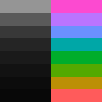

# Sopa de Mamaco

> Uma delícia

A GUI-only dark color scheme for [Neovim](https://neovim.io).

## Features

- Dark theme.
- Grayscale according to the golden ratio.
- Colors evenly distributed across the spectrum.
- Foreground colors have the same lightness.
- Similar colors have similar meanings.

## Colors

| #  | HTML    | HUE    | L\*   |
|----|---------|--------|-------|
|  0 | #080808 |   0    |  2.19 |
|  1 | #0c0c0c |   0    |  3.32 |
|  2 | #121212 |   0    |  5.46 |
|  3 | #1a1a1a |   0    |  9.26 |
|  4 | #252525 |   0    | 14.68 |
|  5 | #383838 |   0    | 23.52 |
|  6 | #5a5a5a |   0    | 38.24 |
|  7 | #959595 |   0    | 61.7  |
|  8 | #ff5b5b |   0    | 61.22 |
|  9 | #bc8f05 |  45.25 | 61.95 |
| 10 | #54a900 |  90.18 | 61.88 |
| 11 | #00ad2b | 134.91 | 61.71 |
| 12 | #00a7a7 | 180    | 62.02 |
| 13 | #6b90ff | 225    | 61.91 |
| 14 | #ba74ff | 270.22 | 61.78 |
| 15 | #fc4ad0 | 314.83 | 61.78 |

## Supported Plugins

- [bufferline.nvim](https://github.com/akinsho/bufferline.nvim)
- [nvim-tree.lua](https://github.com/kyazdani42/nvim-tree.lua)
- [nvim-treesitter](https://github.com/nvim-treesitter/nvim-treesitter)
